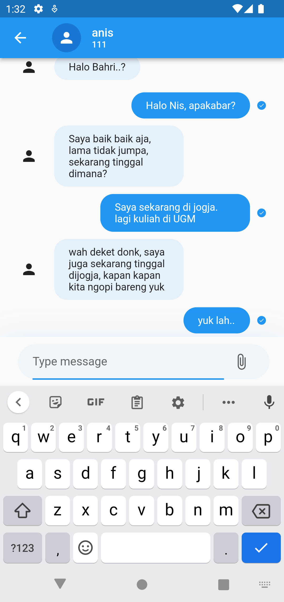
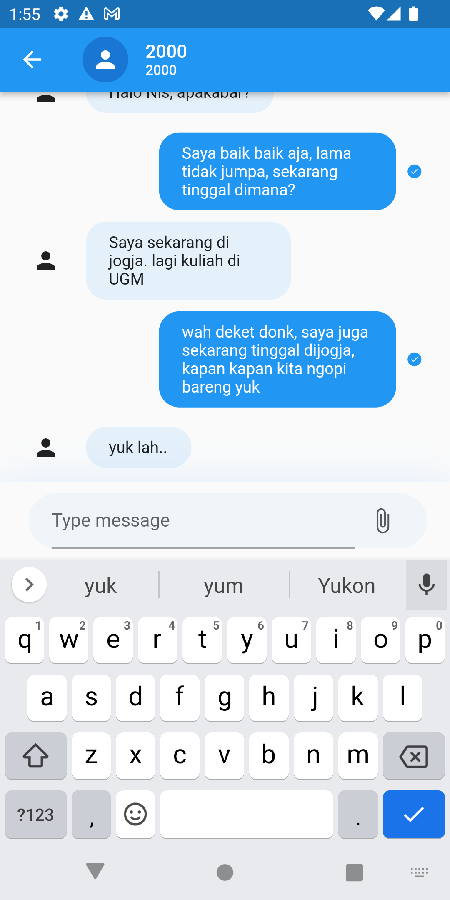

# Flutter Chat App with Zegocloud sdk

Sample chat app with flutter and zegocloud sdk zimkit

· Sign up for 10,000 free mins: https://bit.ly/3AW3Ylr
· Find out more about ZEGOCLOUD: https://bit.ly/3Ukfm1A
· How to create video call app: https://bit.ly/3gMh2mJ

## Youtube Link

https://youtu.be/GgFwtd1YW3w

## Playlist Flutter Intensive Club

https://www.youtube.com/playlist?list=PLQvQbJRJpIZ67MrVzPDOYtAs7wmFjmFUI (https://www.youtube.com/playlist?list=PLQvQbJRJpIZ67MrVzPDOYtAs7wmFjmFUI)

## ScreenShot

| Home         | Add           |
|--------------|----------------|
|  |       |

## Contact:
* Consultation Flutter and Endorse https://t.me/bahri_bhe
* Youtube: https://youtube.com/@codewithbahri
* Github: https://github.com/bahrie127
* Linkedin: https://linkedin.com/in/bahrie
* Roadmap Flutter: https://youtu.be/e2zMJqDBmoY
* Medium: https://medium.com/@bahri

